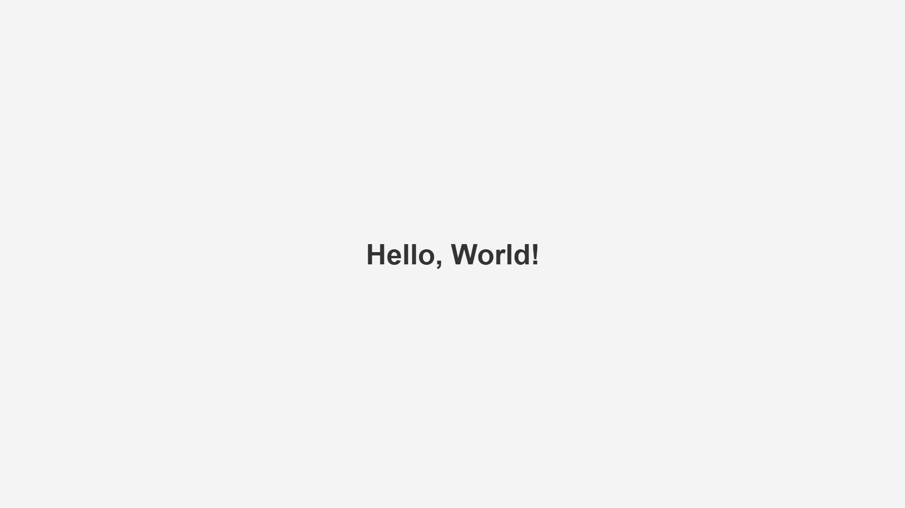

# Hello World

🌐 **Live Demo:** https://mernstack-sage-sigma.vercel.app/

## Stack
[]()
[]()

## Preview



## About

A simple HTML page that displays **"Hello, World!"** centered on the screen using HTML and CSS.

## Features

- Clean HTML5 structure
- Responsive layout
- Flexbox-centered content
- Minimal and readable design

## Project Structure

```text
.
└── index.html
```

## Technologies Used

- HTML5
- CSS3