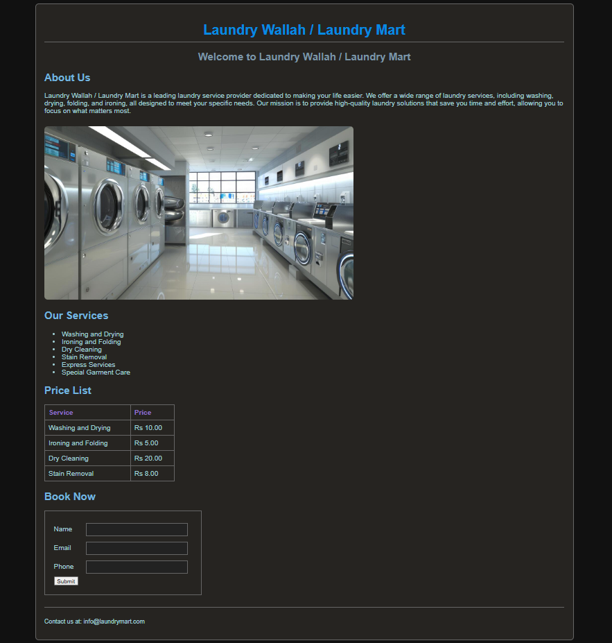

# Laundry Wallah / Laundry Mart

🌐 **Live Demo:** https://mernstack-5iyu.vercel.app/

## Stack

[]()
[]()

## Preview



## About

A simple laundry service website built using HTML and CSS. It includes service information, pricing details, a booking form, and contact information.

## Features

- Responsive design
- About Us section with image and description
- Services list
- Pricing table
- Booking form
- Contact footer

## Project Structure

```text
.
└── index.html
```

## Technologies Used

- HTML5
- CSS3