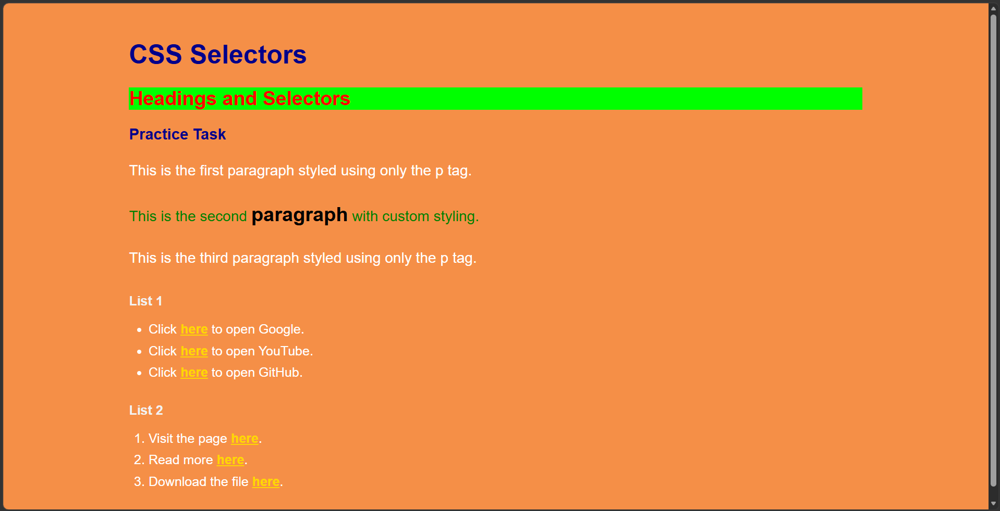

# CSS Selectors

> **Note**
>
> I understand the concern regarding the presentation of this readme file, coming forth as generated using AI, but that is not the case. I have worked on software projects before, so I generally follow the same documentation style across all my repositories. I am currently documenting my journey of learning the MERN stack on GitHub, and I try to maintain consistent, well-structured READMEs for every exercise, even for beginner assignments. The styling of this README is a personal documentation preference and was not intended to misrepresent my understanding of the concepts.

🌐 **Live Demo:** https://mernstack-pvh5.vercel.app/

## Stack

[]()
[]()

## Preview



## About

This assignment demonstrates the use of different CSS selectors in a simple HTML page. It covers:

- Element selectors
- Class selectors
- ID selectors
- Descendant selectors
- CSS specificity

The goal of the exercise is to understand how different selectors target HTML elements and how selector specificity affects which styles are applied.

## Features

- Applied an element selector to style all paragraph elements.
- Used a class selector (`.head`) across multiple headings.
- Used an ID selector (`#bglime`) to uniquely style the second heading.
- Demonstrated CSS specificity by overriding the paragraph style using the `#para` ID selector.
- Used a descendant selector to style only the `span` elements inside list items.
- Created both ordered and unordered lists following the assignment requirements.

## How to Run

1. Download or clone this repository.
2. Ensure both `index.html` and `style.css` are in the same folder.
3. Open `index.html` in any modern web browser.
4. The stylesheet will automatically be loaded through the `<link>` tag.

## Project Structure

```text
.
├── index.html
├── style.css
└── README.md
```

## Technologies Used

- HTML5
- CSS3

## What I Learned

Through this exercise I practiced:

- Connecting an external stylesheet to an HTML document.
- Using element, class, ID, and descendant selectors.
- Understanding CSS selector specificity.
- Applying different styles without using inline CSS.
- Structuring HTML so CSS selectors can target elements effectively.