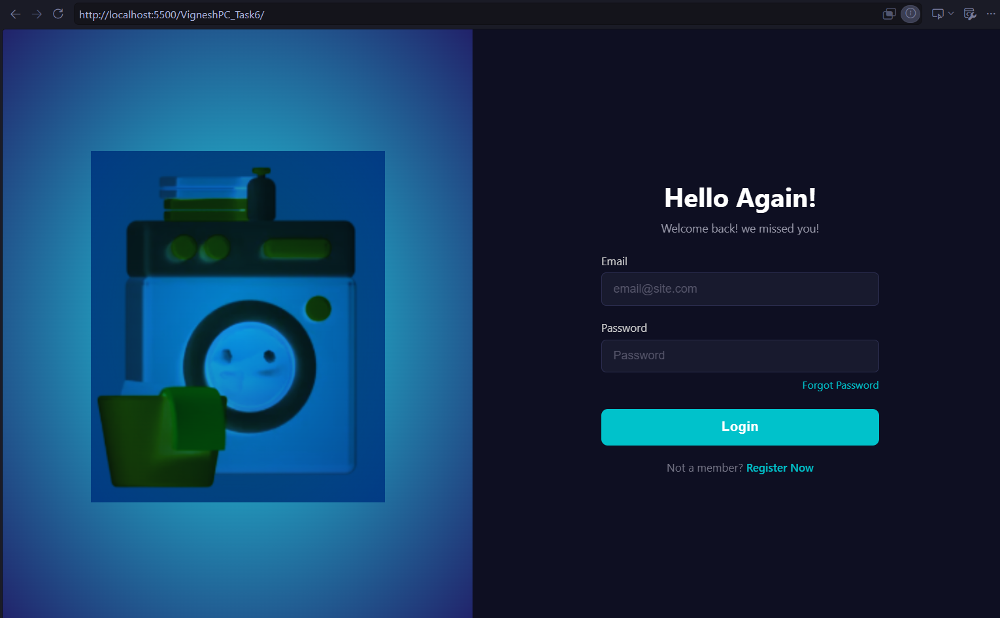

# CSS Login Page: Flexbox

> **Note**
>
> I understand the concern regarding the presentation of this readme file, coming forth as generated using AI, but that is not the case. I have worked on projects before, and I keep a consistent documentation style on GitHub because I am also recording my MERN stack learning journey. For this revision, I have kept the README clear and simple, and I have added comments in the HTML and CSS files to explain the Flexbox choices used in this assignment.

🌐 **Live Demo:** https://mernstack-v1ld.vercel.app/

## Stack

[]()
[]()

## Preview



## About

This is a CSS practice task focused on Flexbox. It builds a split-screen login page for Laundry Mart with an illustration on the left and a login form on the right.

The assignment practices:

- `display: flex`
- `justify-content`
- `align-items`
- `flex-direction`
- `flex: 1`

## Features

- Full-screen split layout using Flexbox.
- Equal-width left and right sections using `flex: 1`.
- Image and form centered using `justify-content` and `align-items`.
- Form fields stacked using `flex-direction: column`.
- Simple styling for inputs, button, and links.

## How to Run

1. Download or clone this folder.
2. Keep `index.html`, `style.css`, and `washingmachine.png` in the same directory.
3. Open `index.html` in any browser.

## Project Structure

```text
.
├── index.html
├── style.css
├── washingmachine.png
└── README.md
```

## Technologies Used

- HTML5
- CSS3

## Concepts Learned

- Creating a two-column layout with Flexbox.
- Using `flex: 1` to split available space equally.
- Centering items with `justify-content` and `align-items`.
- Stacking form elements with `flex-direction: column`.
