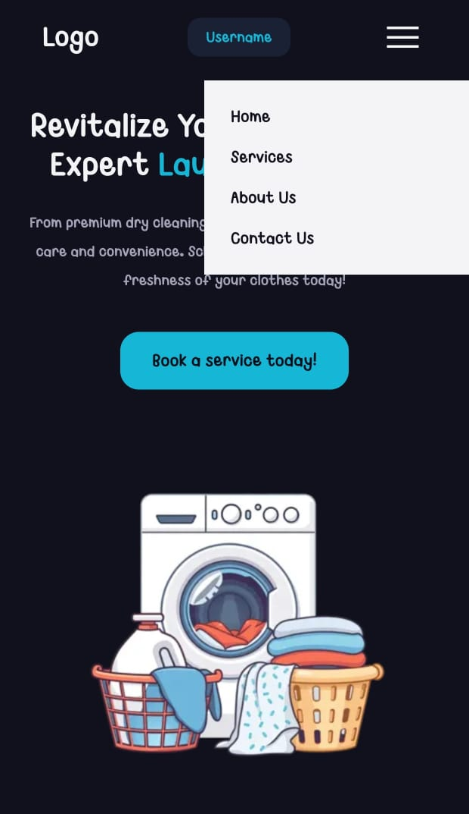

# CSS Hamburger Menu: Focus & Sibling Selectors

> **Note**
>
> I understand the concern regarding the presentation of this readme file, coming forth as generated using AI, but that is not the case. I have worked on projects before, and I keep a consistent documentation style on GitHub because I am also recording my MERN stack learning journey. For this revision, I have kept the README clear and simple, and I have added comments in the HTML and CSS files to explain the focus and sibling selector logic used in this assignment.

🌐 **Live Demo:** https://mernstack-67sg.vercel.app/

## Stack

[]()
[]()

## Preview

| Menu Closed | Menu Open |
|---|---|
|  |  |

## About

This is a CSS practice task focused on building a mobile hamburger menu without using any JavaScript. In the previous responsive task, the nav links were hidden completely on mobile view. This task adds a hamburger icon that reveals those links in a menu on the right side of the screen when clicked.

The assignment practices:

- `:focus` pseudo-class
- Sibling combinator (`~`)
- `position: absolute`
- Toggling visibility with pure CSS

## Features

- Hamburger icon visible only in mobile view.
- Menu list positioned absolute on the right side of the screen.
- Menu hidden by default using `display: none`.
- Menu revealed using the `:focus` state of the hamburger button combined with a sibling selector, no JavaScript involved.

## How to Run

1. Download or clone this folder.
2. Keep `index.html`, `style.css`, and `washingmachine.webp` in the same directory.
3. Open `index.html` in any browser.
4. Resize to mobile view and click the hamburger icon to open the menu.

## Project Structure

```text
.
├── index.html
├── style.css
├── washingmachine.webp
└── README.md
```

## Technologies Used

- HTML5
- CSS3

## Concepts Learned

- Using the `:focus` pseudo-class to track a click without JavaScript.
- Using the sibling combinator (`~`) to style one element based on the state of another.
- Positioning a menu absolutely within a relatively positioned parent.
- Building interactive UI patterns with CSS alone.