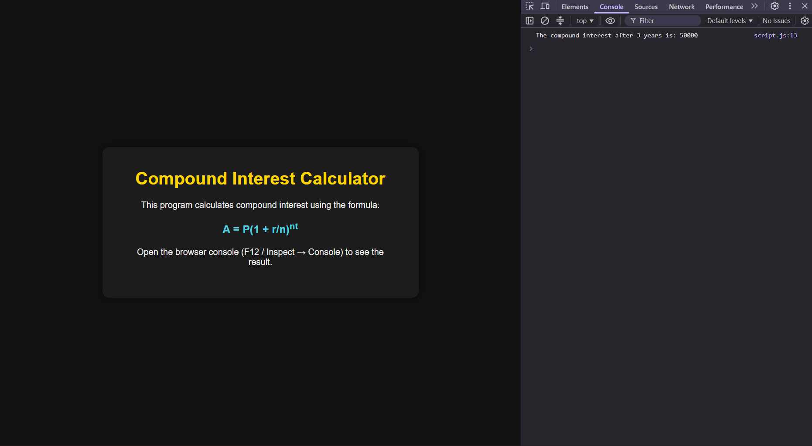

# JavaScript Mini Task: Compound Interest Calculator

> **Note**
>
> I understand the concern regarding the presentation of this readme file, coming forth as generated using AI, but that is not the case. I have worked on projects before, and I keep a consistent documentation style on GitHub because I am also recording my MERN stack learning journey. For this revision, I have kept the README clear and simple, and I have added a couple of comments in the CSS file to explain the animation logic used in this assignment.

🌐 **Live Demo:** https://mernstack-task12.vercel.app/

## Stack


## Preview



## About

A small program that calculates compound interest using predefined (static) values, built to practice using variables and operators in JavaScript.

## Features

- Implements the compound interest formula: `A = P(1 + r/n)^(nt)`
- Uses predefined variables for principal, rate, compounding frequency, and time
- Logs the calculated compound interest to the console

## How to Run

1. Download or clone this folder.
2. Keep `index.html`, `style.css`, and `script.js` in the same directory.
3. Open `index.html` in any browser.
4. Open the browser console (F12 → Console tab) to see the logged result.

## Project Structure

```text
.
├── index.html
├── style.css
├── script.js
└── README.md
```

## Technologies Used

- HTML5
- CSS3
- JavaScript

## Concepts Learned

- Using variables to represent formula inputs (principal, rate, compounding frequency, time)
- Applying arithmetic and exponent operators (`Math.pow`) to implement a real-world formula
- Using `console.log()` with template literals to display calculated output