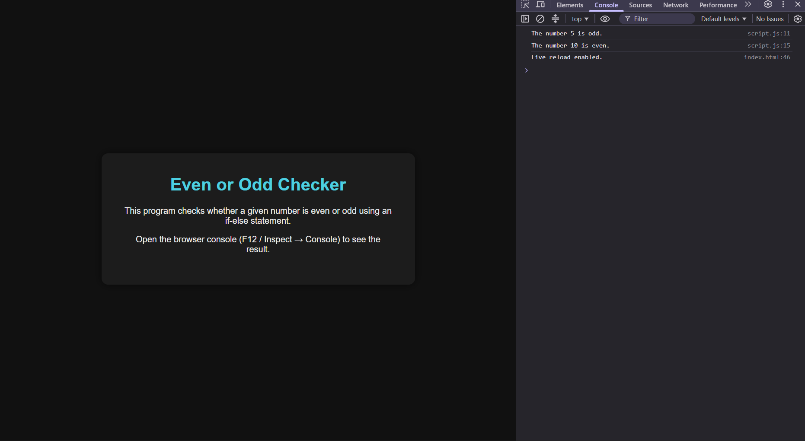

# JavaScript Mini Task: Even or Odd Checker

> **Note**
>
> I understand the concern regarding the presentation of this readme file, coming forth as generated using AI, but that is not the case. I have worked on projects before, and I keep a consistent documentation style on GitHub because I am also recording my MERN stack learning journey. For this revision, I have kept the README clear and simple, and I have added a couple of comments in the CSS file to explain the animation logic used in this assignment.

🌐 **Live Demo:** https://mernstack-task12.vercel.app/

## Stack


## Preview



## About

A small program that checks whether a given number is even or odd, built to practice using variables and if-else statements in JavaScript.

## Features

- Checks two numbers using the modulo operator (`%`)
- Uses an if-else statement to decide even vs. odd
- Logs a message for each number to the console

## How to Run

1. Download or clone this folder.
2. Keep `index.html`, `style.css`, and `script.js` in the same directory.
3. Open `index.html` in any browser.
4. Open the browser console (F12 → Console tab) to see the logged result.

## Project Structure

```text
.
├── index.html
├── style.css
├── script.js
└── README.md
```

## Technologies Used

- HTML5
- CSS3
- JavaScript

## Concepts Learned

- Using the modulo operator (`%`) to find a remainder
- Using an if-else statement to branch logic based on a condition
- Logging conditional results to the console with template literals