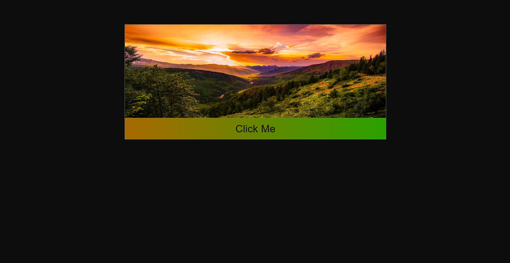

# CSS Units, Box Model & Fonts

🌐 **Live Demo:** _Add your deployed URL here_

## Stack

[]()
[]()

## Preview



## About

A CSS practice task focused on viewport units, the box model, and font sizing. It features a centered image card with a styled gradient button, built entirely with HTML and CSS using relative and viewport-based units throughout.

## Features

- Viewport units (`vw`, `vh`) for fluid, screen-relative sizing
- Box model reset using `box-sizing: border-box` and a universal `*` selector
- Centered layout using `margin: auto` with a `50vw` constrained container
- Full-width responsive image with a fixed viewport height
- Gradient button using `linear-gradient` with viewport-scaled font size
- Dark theme with a subtle border treatment

## Project Structure

```text
.
├── index.html
└── style.css
```

## Technologies Used

- HTML5
- CSS3