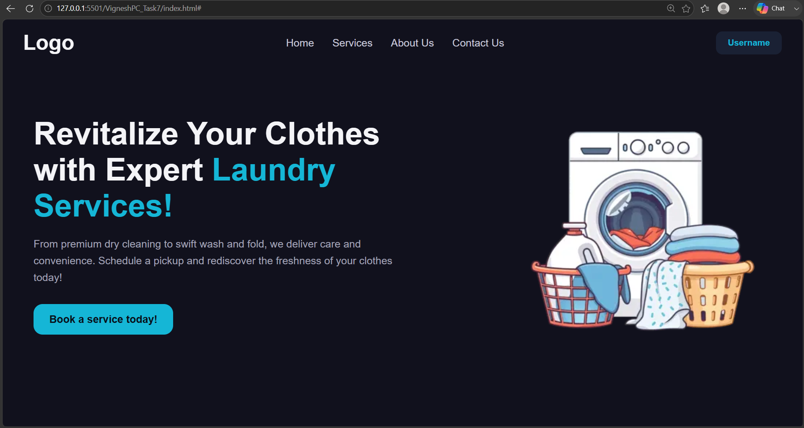

# CSS Responsive Issues: Media Queries

> **Note**
>
> I understand the concern regarding the presentation of this readme file, coming forth as generated using AI, but that is not the case. I have worked on projects before, and I keep a consistent documentation style on GitHub because I am also recording my MERN stack learning journey. For this revision, I have kept the README clear and simple, and I have added comments in the HTML and CSS files to explain the media query choices used in this assignment.

🌐 **Live Demo:** https://mernstack-v1ld.vercel.app/

## Stack

[]()
[]()

## Preview



## About

This is a CSS practice task focused on responsive design using Media Queries. It takes the Laundry Mart hero section built in a previous task and makes it responsive across desktop, tablet, and mobile screens.

The assignment practices:

- `@media` queries
- Responsive typography and image sizing
- `display: flex` instead of `display: inline`
- `flex-direction: column` for stacked mobile layouts

## Features

- Navbar switches from `inline` to `flex` layout.
- Nav links, logo, and username text shrink on tablet view.
- Nav links are hidden on mobile, leaving only the logo and username.
- Hero section text and image sizes reduce on tablet view.
- Hero section switches to a stacked, centered layout on mobile using `flex-direction: column`.

## How to Run

1. Download or clone this folder.
2. Keep `index.html`, `style.css`, and `washingmachine.webp` in the same directory.
3. Open `index.html` in any browser.
4. Resize the browser or use dev tools device toolbar to check tablet and mobile views.

## Project Structure

```text
.
├── index.html
├── style.css
├── washingmachine.webp
└── README.md
```

## Technologies Used

- HTML5
- CSS3

## Concepts Learned

- Writing and structuring media queries for different breakpoints.
- Adjusting font sizes and spacing for smaller screens.
- Switching `display: inline` to `display: flex` for consistent layout control.
- Using `flex-direction: column` to reflow a layout on mobile.
- Hiding elements conditionally with `display: none` inside media queries.